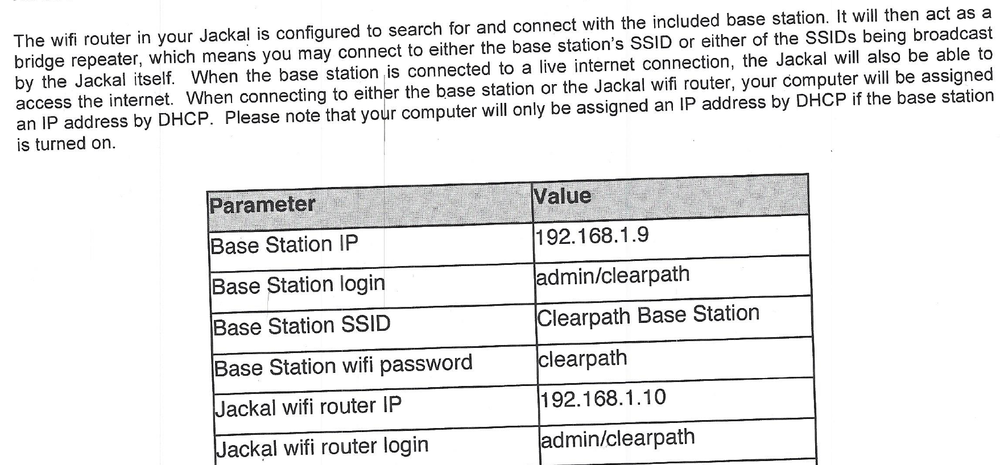
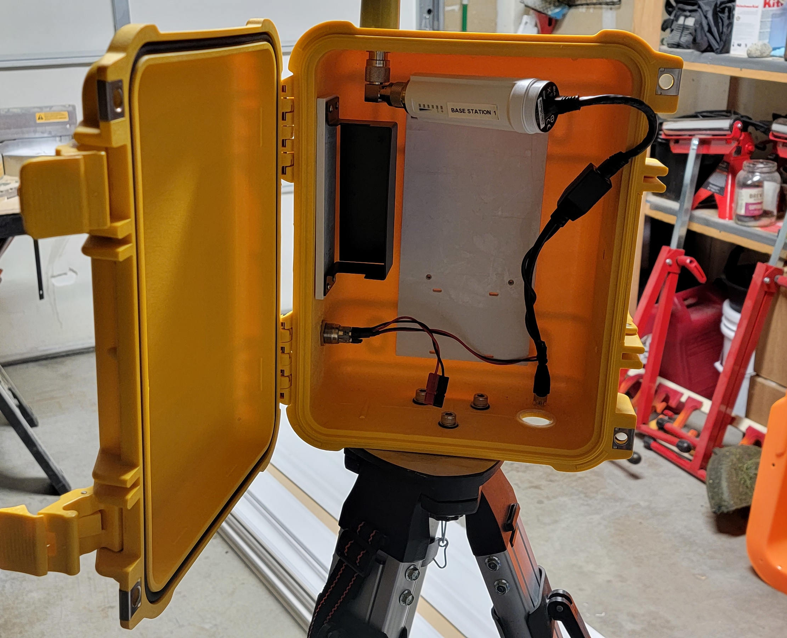
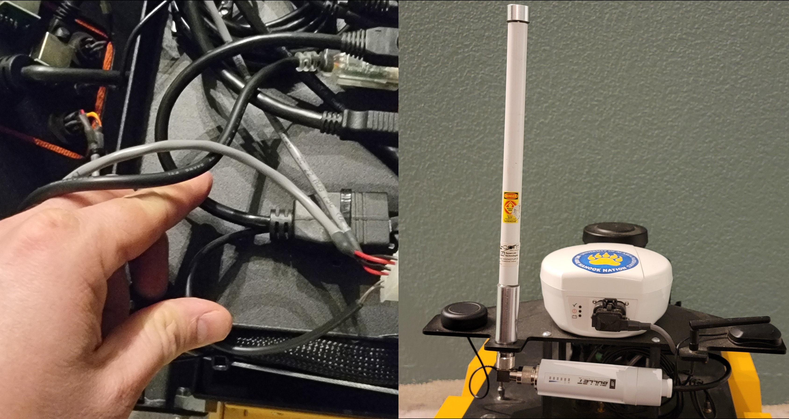
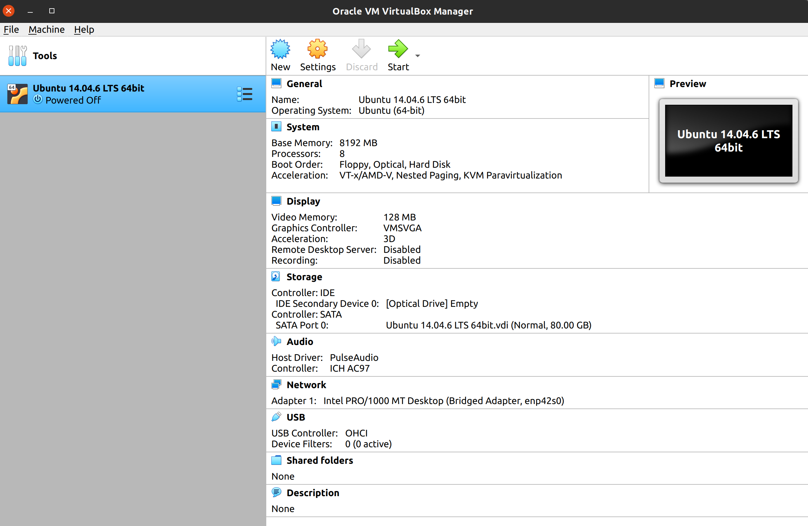
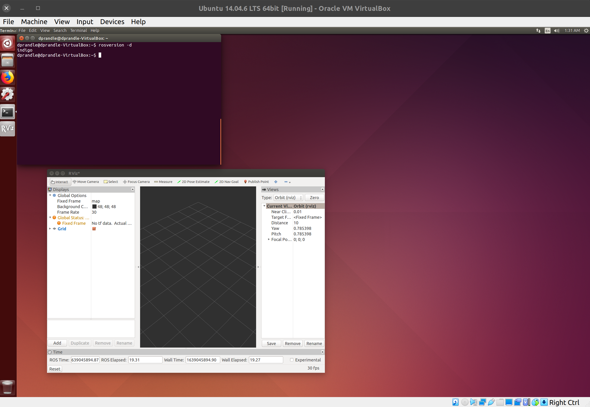
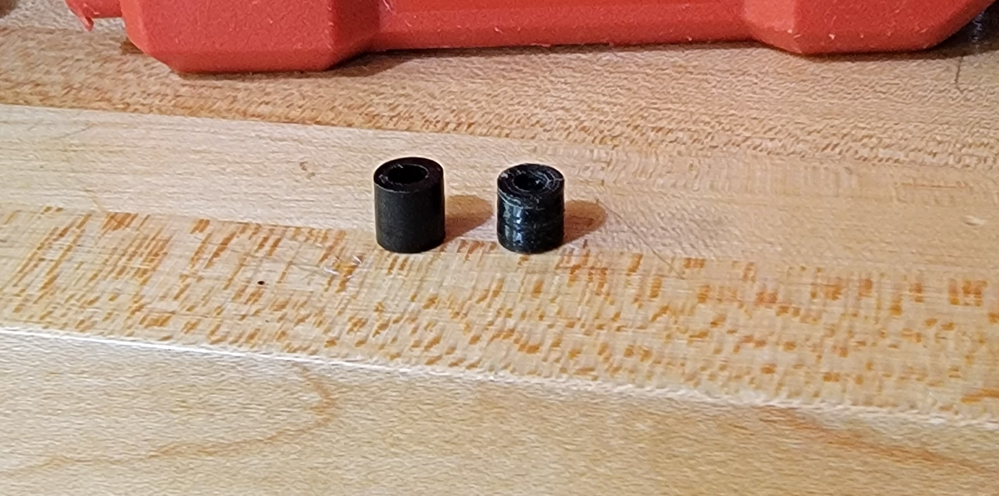
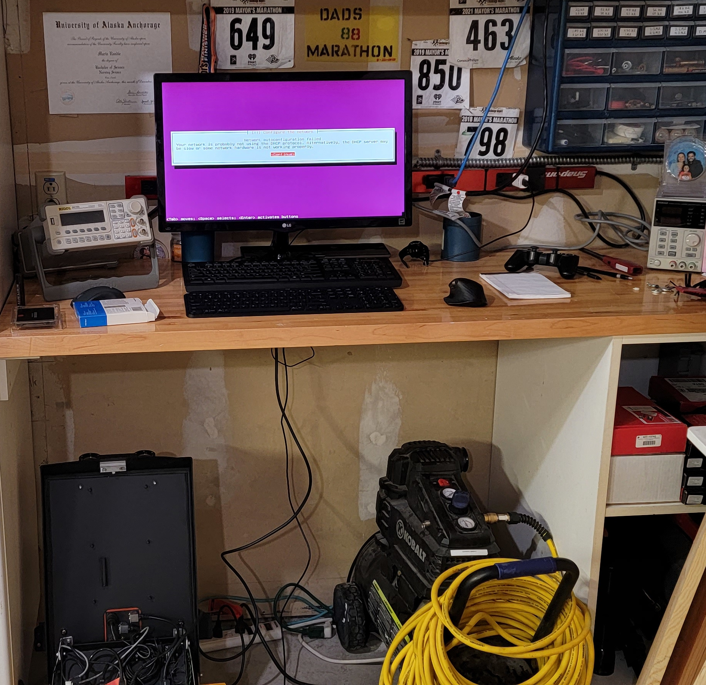
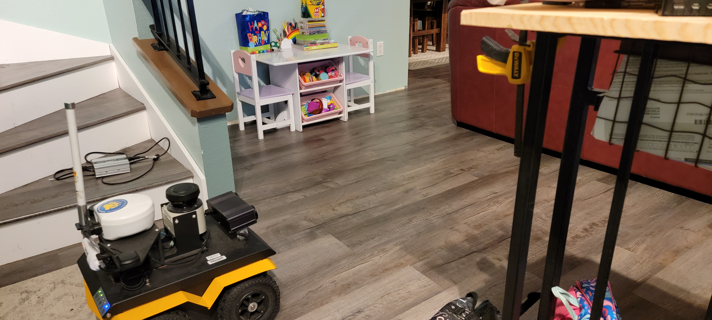
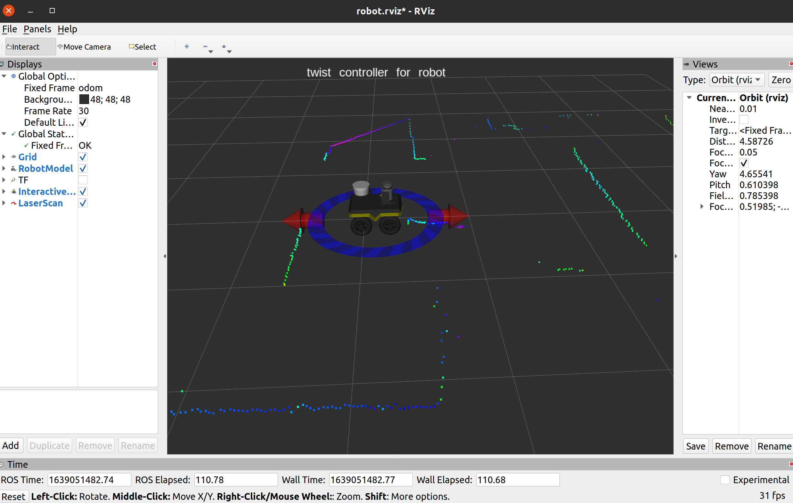

<link rel="stylesheet" href="jackel_and_ros.css" type="text/css" media="all" href="URL" />

# Jackal and ROS

Bringing UAF's Clearpath Jackal to 2021

## TLDR

Go to [videos](#videos)

## Background

The Clearpath Jackal is a UGV (unmanned ground vehicle) that UAF purchased sometime around 2015. I don't remember the details of the purchase, but it was prompted by Pogo Mine requesting (in the form of a grant) that UAF develop a mine rescue system. I believe they were also looking for the capability generate basic maps and autonomously navigate. At the time, a UGV/Drone combination seemed promising (and perhaps it still does), so the Jackal and Grizzley were purchased and several grad students took on projects to aid in this effor, myself included.

The Jackal isn't the UGV that UAF has in mind to perform the main rescue operations: The Grizzly is much larger and more capable of traversing course terrain. The Jackal, however, is small enough for grad students and UAF faculty to haul around, and it provides similar hardware. The Jackal is an effective prototyping platform. Since both the Grizzley and the Jackal run on ROS (Robot Operating System) porting nodes from one vehicle to the other - such as an autonomous navigation node - is trivial.

In this entry, I'm going to devlog the process I went through to bring the Jackal up to date. I'm also going to cover using ROS to interface with the jackal - by the end we will:
- Build a map of a room in rviz with gmapping using the Jackal's odometry and Lidar
- Build a custom ROS node which will let us drive the jackal with a keyboard
- Use Gazebo to simulate the jackal

This process involved a lot of trial and error: For the sake of brevity, much of the error is filtered out. I will try to include some specific *gotcha* items.

## ROS Introduction

If you are interested in ROS but currently unfamiliar, I would recommend following these ROS [tutorials](http://wiki.ros.org/ROS/Tutorials). You can get through them in an hour or two.

If you don't have time for the ROS tutorials (or don't have time *right now*), heres a quick rundown. ROS works by providing a set of command line tools (as in - executables) which allow you to navigate and operate on ROS items the same way that linux provides command line tools that allow you to operate on files. So why not just use Linux? You can - but - because ROS narrows its scope down so much on what it provides - focusing on robot tasks and communication - the simple format allows writing software once and it will work with a huge variety of tools (like RViz or gazebo).

The ROS basic unit is a "Node": This is an executable file that is written in python or c++. Nodes are bundled in packages and started by either running a node directly with:
```bash
rosrun yournode
```
or
```bash
roslaunch yourpackage yourlaunchfile.launch
```
where you provide a special launch file where you can specify parameters and other things for launching your nodes. Nodes communicate with other nodes by either subscribing to messages on a certain topic, or publishing messages on a certain topic. Messages are data types - for example geometry_msgs/Vector3 is a 3 element struct in c++ with x y and z. You can use YAML to specify this on the command line.

You can view messages that are being published to topics in realtime by echoing the message:
```bash
rostopic echo /cmd_vel
```
would display all messages on /cmd_vel. You can also publish messages directly to topics using the command line:
```bash
rostopic pub geometry_msgs/Twist /cmd_vel -r 30 [1.0 0.0 0.0 0.0 0.0 0.0]
```
This would publish the passed in message 30 times per second.

ROS makes heavy use of sourcing scripts in order to set up environment variables. All ROS standard published packages go to /opt/ros/*distro*/share, and when you install ROS a special setup.sh is placed in /opt/ros/*distro*/ - this script must be sourced in every terminal you use ROS (or export added to ~/.bashrc). Without that, the ros commands won't work. It's not automatically added to the path on install, I assume to keep from cluttering your environment when not using ROS.

Many times, there are packages that haven't made it to the published repositories yet and so you need to build them from source. With ROS its easy just like linux. After calling catkin_make in your workspace which contains the needed package, another setup.sh is placed in your_workspace/devel folder. Sourcing this setup.sh file will make the package visible to roslaunch, and all of its nodes to rosrun, all messages to rosmsg, etc. To install in the /opt/ros/*distro*/share folder, just call make install like a normal c++ library.

Whew - now on to the Jackal!

## Wifi

To do anything, wifi must work. Here is what the UAF specific config document from Clearpath says:

<p align="center">

</p>

Unfortunately, non of this was correct accept the username and password for the router login - which by the way - is username: admin and password: clearpath (that threw me off for a bit). The base station was missing the battery - it is powered from a 24V molex connector that goes to an ethernet cable to provide PoE.

<p align="center">

</p>

The wifi router is the little "bullet" unit. I got it fired up by using the jackal battery. At some point in time a student uploaded OpenWRT firmware, and so all Clearpath settings were gone. After messing with the settings for a little bit on WRT, I decided to abandon the base station - its not required. The Jackal has the same wifi router - Ubiquiti Bullet M2. It is also powered by PoE cable, which works fine when the Jackal is on. It has a monster dipole antenna on it like the base station as well.

The router was broadcasting "Clearpath Base Station" SSID, but trying to connect would always fail (I tried every option on Mac/Linux/Windows). In order to reconfigure the router, I needed to connect via LAN port. Since it is PoE, I opened up the jackal and connected after the PoE was applied. You can see in the image where the power comes from - luckily I had a little ethernet female to female bullet.

<p align="center">

</p>

Once connected, I configured my computer to the same subnet. By ping I realized the IP was *192.168.1.10* and logged in. I switched the wireless mode from Wireless AP to Access Point, and moved it from Bridge mode to Router mode for it's LAN port. Setting it as Wireless AP instead of Bridge allowed me to change security from WEP to WPA2, which I thought would fix the login problem.

With all the new settings, it still would not allow logins from any device. I changed channel spacing (with certain channel widths the SSID will actually dissappear for most devices) and frequency assignment, and plethora of other settings and nothing would work. I downloaded the latest firmware, which since the device was end-dated wasn't *that* much newer, and installed. Still no luck. I could, however, switch to "Station" mode and connect to my home wifi if I set the spacing to 40 MHz and the frequency to auto.

Through forum crawling, I finally found the magic setting. It was a Ubiquiti special thing called "AirMax". Basically - it appends special packet headers which other Ubiquiti devices use to provide a bandwidth optimized wireless network. Of course the setting completely dissappears if you are in "Station" mode - so while I recognized that it must be that, I could not find how to turn it off. After going down the rabbits hole trying to mess with values that are loaded from a backup config file, I finally figured out the setting becomes visible once you put the router back in Wireless AP mode. So, put in wireless AP, turned off AirMax, voila - could now connect to the Jackal's access point.

With all of that, I put it back in bridged station mode and gave it a static IP address, along with the Jackal NIC it connects to. I then configured my home router to not hand out those IPs. The AP is necessary, eventually, but for now I need internet on the Jackal. I settled with the Jackal IP set to 192.168.1.11/24.

## ROS Indigo and Virtual Machine

With Wifi working, I SSHd into jackal and found Ubuntu 14.04 and ROS Indigo - which is what the Clearpath document specifies. The Jackal comes with a PS3 controller: on startup a ROS node is launched which searches for the PS3 controller file /dev/input/ which publishes geometry_msgs/Twist messages to the /cmd_vel topic. This node lives in a ROS package called jackal_description. On driving the jackal with the controller, I could see the messages being published. I was also able to publish geometry_msgs/Twist messages to the /cmd_vel topic from the ssh terminal and drive the jackal.

In order to drive the jackal from a remote desktop, or view sensor data with rviz, I needed to setup ROS over the network (Jackal runs Ubuntu server). To do this, I need the same ROS distrobution installed on my desktop, which means I also need the same Ubuntu version. I tried to install Ubuntu 14 on my desktop with no success as my hardware was too new (well - actually it worked. It just would not recognize my wifi or ethernet adaptor - which is a problem) so - I set up a virtual machine.

<p align="center">

</p>

To setup the VM, I had to turn some virtualization option on in my BIOS (processor setting). I then created a virtual hard drive, and allocated resources for a virtual machine. To install Ubuntu 14.04, I used the same image that I used to install on my desktop and created a virtual flash drive. It took some fiddling, but I got it working:

<p align="center">

</p>

Running things through the VM was cumbersome for many reasons. I decided to upgrade the Jackal to Ubuntu 20.04 and ROS Noetic. This would give me access to the latest jackal gmapping packages and URDF files compatible with gazebo (these are all located in the newest jackal_description package). I was scared of breaking the Jackal (it was expensive), so I purchased a new hard drive.

## Update to Ubuntu 20.04 and ROS Noetic

I removed the old hard drive and installed the new one (1 TB flash drive). During the process, I lost one of the hard drive spacers, so I 3d printed a new one (on the right):

<p align="center">

</p>

Clearpath released a [ubuntu image for the jackal](https://packages.clearpathrobotics.com/stable/images/latest/noetic-focal/amd64/), so I was at least able to use that. Here is a pic of the process:A

<p align="center">

</p>

Once the jackal was updated, I had to get the PS3 controller working. Because of the end of [this page](https://www.clearpathrobotics.com/assets/guides/noetic/jackal/startup.html), I thought I needed to get sixad working and pair it with sixpair. I had to build it from source, since it was no longer on apt, and when I did it, like, kind of worked. It was wierd - it would say it was paired and the controller would go solid, but then it would unpair again.

Anyways, turns out linux can pair now out of the box which is why sixad is obsolete im assuming. I had to connect the controller with usb, open bluetoothclt pair mode, accept the pair, and then it was paired.

The next problem was getting the ROS node to source the correct file in /dev/input. The default for the node searches for /dev/input/ps4 file, and they have a udev rule in /dev/udev that detects and added /dev/input/js* files and creates a link to that file at /dev/input/ps4. The main problem is that the udev rule searches for a device string that is specific to PS4 when it is connected. I found the correct string for the PS3 controller using bluetoothctl, and made the udev rule as follows:

```bash
KERNEL=="js*", SUBSYSTEM=="input", ATTRS{name}=="Sony PLAYSTATION(R)3 Controller", MODE="0666", SYMLINK+="input/ps4"
```
With that I could see the rostopic echo for the playstation controller.

The PS3 and PS4 controllers have fast and slow enable buttons - one of these must be pressed in order to drive the jackal. The enable button codes for the PS4 don't exist on the PS3 controller, so the last thing I had to do was remap these codes to PS3 controller button codes. Once I did that, everything worked.

## Controlling Jackal from Desktop

For a ROS system, there can be only one machine running roscore. This machine is the "Master". In order for the remote machine (aka my desktop) to view or do anything with the master ROS nodes, the ROS_MASTER_URI environment variable on the remote machine must be set to the IP address or hostname of the machine running roscore on port 11311. If you use hostname, that hostname to IP address mapping should be added to /etc/hosts. Since its cumbersome to export this variable on every shell, my ~/.bashrc has these lines added to it:

```bash
source /opt/ros/noetic/setup.bash
export ROS_MASTER_URI=http://cpr-uaf01:11311
```
 
 and I have
 
 ```
 192.168.1.11    cpr-uaf01
 ```

in my /etc/hosts file on my desktop machine. In order for the jackal to accept any published messages from the desktop, it must have the desktop IP to host name mapping added to its /etc/hosts file. This is why I opted for static IP addresses.

With that, I was able to publish /geometry_msgs/Twist to the /cmd_vel topic and move the jackal around.

## Setup jackal_viz, jackal_navigation, and jackal_gazebo

Normally to install packages you use apt:

```bash
sudo apt install ros-noetic-jackal-viz
```

for example. There are almost no jackel packages available in the defaul apt repo however. The first thing I tried was to add a clearpath repository to the PPA list, but it kept failing with "No Release" error of some sort. I ended up downloading each of the needed packages directly from the git repos, running catkin_make, and sourcing their scripts. This worked great. However, I did end up finding a PPA that worked to get the latest jackal packages - this was from the ROS documentation pages:

```bash
wget https://packages.clearpathrobotics.com/public.key -O - | sudo apt-key add -
sudo sh -c 'echo "deb https://packages.clearpathrobotics.com/stable/ubuntu $(lsb_release -cs) main" > /etc/apt/sources.list.d/clearpath-latest.list'
sudo apt-get update
```

The last thing I needed to do to get everything working was to set some environment variables on the jackal before it starts ROS. In the jackal_description folder, under urdf/ there are some URDF files (robot descriptions). If you open up accessories.urdf.xacro, there are a nuch of code sections like this:

```xml
  <!--
    Add primary/secondary 2D lidar sensors.  By default these are SICK LMS1xx but can be >
    JACKAL_LASER_MODEL and JACKAL_LASER_SECONDARY_MODEL environment variables. Valid mode>
    - lms1xx (default) :: SICK LMS1xx
    - ust10            :: Hokuyo UST10
  -->
  <xacro:if value="$(optenv JACKAL_LASER 0)">
    <xacro:property name="lidar_model" value="$(optenv JACKAL_LASER_MODEL lms1xx)" />
    <xacro:if value="${lidar_model == 'lms1xx'}">
      <xacro:include filename="$(find jackal_description)/urdf/accessories/sick_lms1xx_mo>
      <xacro:sick_lms1xx_mount prefix="$(optenv JACKAL_LASER_MOUNT front)"
           parent_link="$(optenv JACKAL_LASER_MOUNT front)_mount"
           topic="$(optenv JACKAL_LASER_TOPIC front/scan)">
        <origin xyz="$(optenv JACKAL_LASER_OFFSET 0 0 0)"
                   rpy="$(optenv JACKAL_LASER_RPY 0 0 0)" />
      </xacro:sick_lms1xx_mount>
    </xacro:if>
```

I gathered up the optenv variable names for the sensors I wanted enabled, and put them in a config.sh file that is sourced on jackal_bringup before ROS starts:

```bash
#!/bin/sh
export JACKAL_LASER=1
export JACKAL_LASER_HOST=192.168.2.14
export JACKAL_NAVSAT=1
export JACKAL_BB2=1
```

This not only enabled the model files to show up in rviz, but it also added the sensor nodes to the default list of startup nodes when ROS is started on the jackal. Before that, I had to manually start the scanner and camera to get the data in rviz, for example. This also added the correct relationships for the sensors to the jackal's transform. Without that, the scanner data doesn't know where it should project the scan points from.

To start rviz with control and visual jackal feedback:

```bash
roslaunch jackal_viz view_robot.launch
```

<p align="center">


</p>

To launch rviz in gmapping mode to build a map, first launch the navigation node on the jackal, and then launch jackal_viz with in gmapping mode:

```bash
roslaunch jackal_navigation gmapping_demo.launch
roslaunch jackal_viz view_robot.launch config:=gmapping
```

Finally, to simulate the jackal, you can launch gazebo. To do this, the master needs to be set to the machine running the simulation, and roscore started:

```bash
export ROS_MASTER_URI=http://localhost:11311
roscore
```

And now you can launch rviz in the same ways as before. You can launch it normally and just drive around (which will show up in Gazebo), or you can launch the jackal navigation node (remember, gazebo is simulating all of the jackal nodes) and then rviz in gmapping mode to watch it build a map of the gazebo environment.

## Driving the jackal from the keyboard

Last but not least, I made a node to drive the jackal with my keyboard. This is mostly for easy simulation - I didn't want to repair the PS3 controller to my desktop machine to simulate, and the GUI handles in rviz are terrible for driving the robot.

You can drive the jackal with wsad, and emergency stop is space bar. The arrow up shifts up, and arrow down shifts down - you don't have to shift in sequence though. Basically its more like steps I guess - when you start the node its at step zero so wsad keys do nothing, and you can step up to 10, where wsad keys are very fast.

To get input, I used glfw. The code is [here](https://github.com/dprandle/jackal_keyboard_control).

After building with catking_make (with the package in your workspace), you can source like any other package by sourcing the setup script in devel folder.

## Videos

### [Mapping My Living Room](https://youtu.be/iQgFbORgBkY)
### [Driving with keyboard to build map of gazebo world](https://youtu.be/DdhP3XU2Vvc)

## Useful links

[Clearpath Jackal Github Repo](https://github.com/jackal)

[Clearpath Jackal Page](https://www.clearpathrobotics.com/assets/guides/noetic/jackal/index.html#)

[Jackal Noetic Bringup](https://github.com/dinvincible98/Jackal_ROS_Noetic_Bringup)

[Jackal Melodic Bringup](https://github.com/robo-jordo/jackal_melodic_bringup)